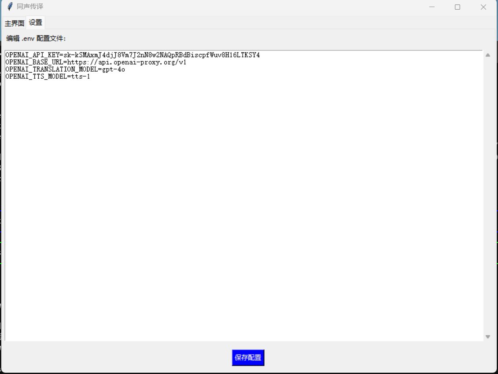
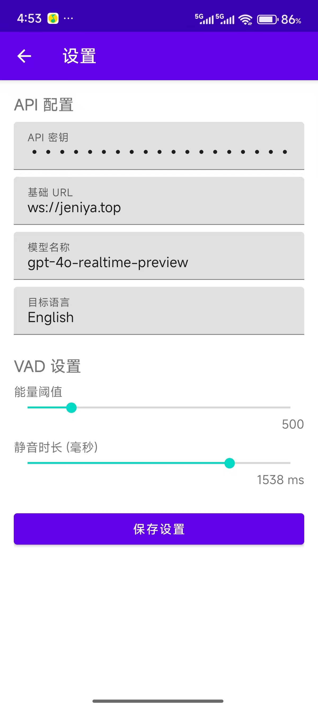
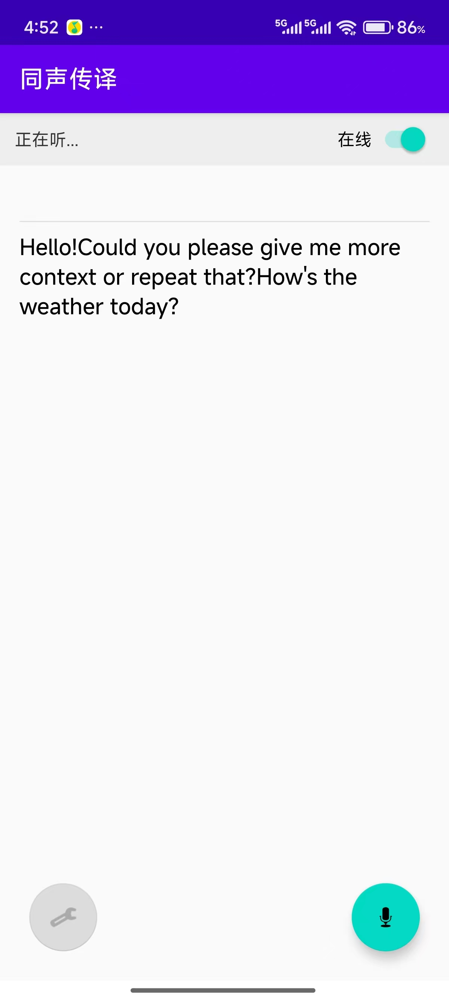

# 基于openai的实时同声传译应用

## GUI界面预览



## Android 应用预览



## 前置要求
- Python 3.10 或更高版本。
- PyAudio 需要 [PortAudio](http://www.portaudio.com/) 运行时环境。在 macOS 上，您可以使用 `brew install portaudio` 进行安装。
- 存储在环境变量中的 OpenAI API 密钥（设置 `OPENAI_API_KEY` 或创建一个 `.env` 文件）。

## 安装
```bash
pip install -r requirements.txt
```

## 配置（支持openai格式的模型，比如deepseek的模型，填写对应的url和模型名字和key就行）
在运行 GUI 之前，创建一个 `.env` 文件或导出环境变量(或者直接在GUI界面的设置页面修改配置)：
```bash
OPENAI_API_KEY=API-KEY
OPENAI_BASE_URL=可以是中转的url
OPENAI_TRANSLATION_MODEL=gpt-4o
OPENAI_TTS_MODEL=tts-1
```

## 使用方法

### 启动 GUI 界面（点击开始的时候会自动下载模型，可以在终端查看进度）
如果您更喜欢图形化界面，可以使用 `--gui` 参数启动：
```bash
python -m src.siminterp --gui --translate --tts --transcriber faster-whisper --whisper-model tiny --whisper-device auto
```
在 GUI 中，您可以方便地选择输入/输出设备、源语言/目标语言、TTS 引擎以及推理设备。

### Android app使用方法
- 安装应用，apk在：app/app/release/app-release.apk
- 打开应用后，先点击设置，填好相关信息，调整好静音时长
- 点击右上角的连接服务器开关
- 按住录音按钮的时候可以说话，松开的时候只播放翻译不会录音


### Doubao AST v4 实时同传（字幕事件驱动，只支持中英互译）
- 前置要求：
  - 安装 `ffmpeg`（用于 Ogg Opus 解码）。
  - 提供编译好的 Protobuf 模块到 `python_protogen` 目录，或设置 `PROTogen_PATH` 指向该目录。
  - 在 `.env` 或环境变量中配置 `VOLCENGINE_APP_KEY`、`VOLCENGINE_ACCESS_KEY`、`VOLCENGINE_RESOURCE_ID`；可选 `VOLCENGINE_AST_WS_URL`。
- 安装依赖：`pip install -r requirements.txt`
- 启动命令：
  - `python doubao_realtime.py --input-language Chinese --target-language English`
  - `--input-language` 支持 `Chinese/English/...`；`--target-language` 同理。
- 音频与事件：
  - 输入：`16kHz/16bit/单通道`，约 `80ms` 一包发送。
  - 输出：服务端返回 Ogg Opus，通过 `ffmpeg` 解码并播放为 `24kHz` PCM。
  - 打印仅在字幕结束事件触发：
    - 原文结束 `TranslationSubtitleEnd` 打印 `🟨 转录: ...`
    - 译文结束 `TranslationSubtitleEnd` 打印 `🟦 翻译: ...`
- 提示：若终端无任何文本输出，请确认服务端确实发送了“字幕开始/增量/结束”事件；本脚本已禁用 Protobuf 中的 `resp.text` 打印，完全以字幕事件为准。

### 使用 OpenAI Realtime 实时同传API (Beta版，支持多国语言，但很贵)
本项目还提供了一个基于 OpenAI 最新 Realtime API (WebSocket) 的极速同声传译脚本。它具有超低延迟和自然的语音交互能力。

**前置要求：**
确保 `.env` 文件中配置了支持 Realtime API 的 `OPENAI_API_KEY` 和 `OPENAI_BASE_URL`。

**启动命令：**
```bash
# 默认翻译为英文
python openai_realtime.py

# 指定目标语言（例如：日语）
python openai_realtime.py --target-language Japanese

# 指定目标语言（例如：中文）
python openai_realtime.py --target-language Chinese
```

**注意：** Realtime API 目前处于 Beta 阶段，价格较高且可能仅部分代理/官方支持。

### 支持的whisper模型（一般选large-v3最好, 但是最慢最占现存）
```
large-v3
large-v2
medium
tiny
base
small
```

### 支持的语言
```
{
    'af': 'Afrikaans', 'am': 'Amharic', 'ar': 'Arabic', 'as': 'Assamese', 'az': 'Azerbaijani', 
    'ba': 'Bashkir', 'be': 'Belarusian', 'bg': 'Bulgarian', 'bn': 'Bengali', 'bo': 'Tibetan', 
    'br': 'Breton', 'bs': 'Bosnian', 'ca': 'Catalan', 'cs': 'Czech', 'cy': 'Welsh', 
    'da': 'Danish', 'de': 'German', 'el': 'Greek', 'en': 'English', 'es': 'Spanish', 
    'et': 'Estonian', 'eu': 'Basque', 'fa': 'Persian', 'fi': 'Finnish', 'fo': 'Faroese', 
    'fr': 'French', 'gl': 'Galician', 'gu': 'Gujarati', 'ha': 'Hausa', 'haw': 'Hawaiian', 
    'he': 'Hebrew', 'hi': 'Hindi', 'hr': 'Croatian', 'ht': 'Haitian Creole', 'hu': 'Hungarian', 
    'hy': 'Armenian', 'id': 'Indonesian', 'is': 'Icelandic', 'it': 'Italian', 'ja': 'Japanese', 
    'jw': 'Javanese', 'ka': 'Georgian', 'kk': 'Kazakh', 'km': 'Khmer', 'kn': 'Kannada', 
    'ko': 'Korean', 'la': 'Latin', 'lb': 'Luxembourgish', 'ln': 'Lingala', 'lo': 'Lao', 
    'lt': 'Lithuanian', 'lv': 'Latvian', 'mg': 'Malagasy', 'mi': 'Maori', 'mk': 'Macedonian', 
    'ml': 'Malayalam', 'mn': 'Mongolian', 'mr': 'Marathi', 'ms': 'Malay', 'mt': 'Maltese', 
    'my': 'Burmese', 'ne': 'Nepali', 'nl': 'Dutch', 'nn': 'Norwegian Nynorsk', 'no': 'Norwegian', 
    'oc': 'Occitan', 'pa': 'Punjabi', 'pl': 'Polish', 'ps': 'Pashto', 'pt': 'Portuguese', 
    'ro': 'Romanian', 'ru': 'Russian', 'sa': 'Sanskrit', 'sd': 'Sindhi', 'si': 'Sinhala', 
    'sk': 'Slovak', 'sl': 'Slovenian', 'sn': 'Shona', 'so': 'Somali', 'sq': 'Albanian', 
    'sr': 'Serbian', 'su': 'Sundanese', 'sv': 'Swedish', 'sw': 'Swahili', 'ta': 'Tamil', 
    'te': 'Telugu', 'tg': 'Tajik', 'th': 'Thai', 'tk': 'Turkmen', 'tl': 'Tagalog', 
    'tr': 'Turkish', 'tt': 'Tatar', 'uk': 'Ukrainian', 'ur': 'Urdu', 'uz': 'Uzbek', 
    'vi': 'Vietnamese', 'yi': 'Yiddish', 'yo': 'Yoruba', 'zh': 'Chinese', 'yue': 'Cantonese'
}
```
